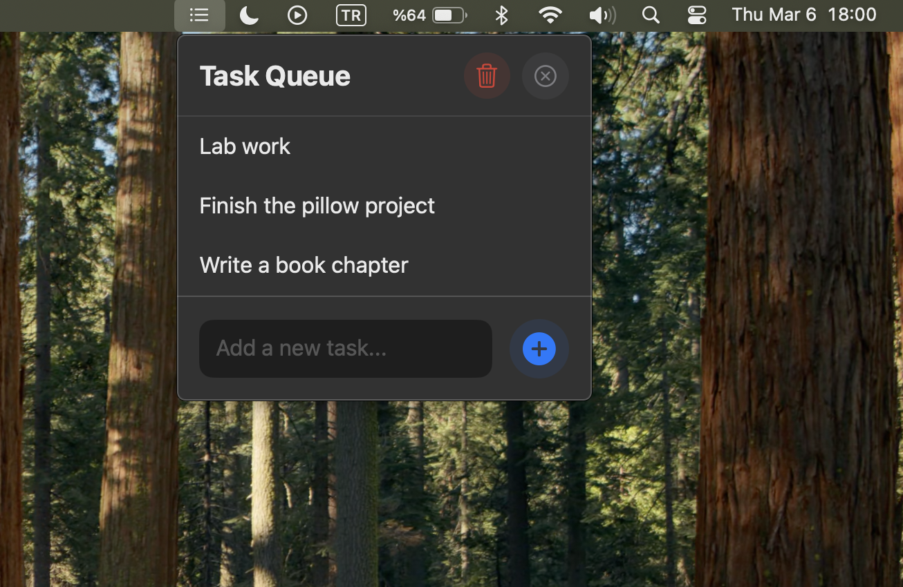

# Taskbar Queue

A simple, elegant menu bar task queue application for macOS. Keep track of your tasks with a clean, distraction-free interface.



## Features

- 🚀 Quick task addition
- ✨ Clean, modern interface
- 🎯 One-click task completion
- 🔄 Smooth animations
- 🗑️ Bulk task reset
- 🌙 Native dark mode support
- 🖥️ Menu bar integration

## Installation

1. Download the latest release from the [Releases](https://github.com/atadagg/taskbar-queue/releases) page
2. Open the downloaded `.dmg` file
3. Drag Taskbar Queue to your Applications folder
4. Launch Taskbar Queue from your Applications folder
5. The app will appear in your menu bar

## Usage

- Click the list icon in your menu bar to open the task queue
- Type a task in the text field and press Enter or click the + button to add it
- Click any task to complete and remove it
- Use the trash icon to clear all tasks at once

## Requirements

- macOS 13.0 or later
- Apple Silicon or Intel Mac

## Development

### Building from Source

1. Clone the repository:
   ```bash
   git clone https://github.com/atadagg/taskbar-queue.git
   ```
2. Open `Taskbar-Queue.xcodeproj` in Xcode
3. Build and run the project

### Requirements

- Xcode 14.0 or later
- macOS 13.0 or later
- Swift 5.7 or later

## License

This project is licensed under the MIT License - see the [LICENSE](LICENSE) file for details.

## Contributing

Contributions are welcome! Please feel free to submit a Pull Request.

## Acknowledgments

- Built with SwiftUI
- Icons from SF Symbols